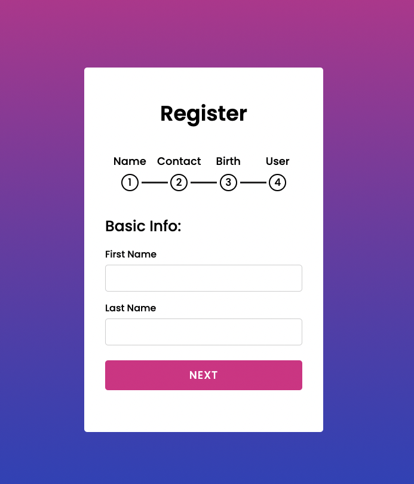

# Multi-Step-Form

[](https://github.com/siryaw/multi-step-form)




## Description

A Multi-Step Form is broken into multiple cards. It requires details to be entered step by step. Enables readability and simplicity to forms without excessive clutter at once. The progress bar informs a user how many steps they have completed and how many steps are remaining.

## Table of Contents

- [Demo](#Demo)
- [License](#license)
- [Questions](#questions)

## Demo

[Demo Here](https://multiformyaw22.surge.sh/)

```

## License

This project is licensed under the MIT license.

## Questions


If you have any questions about the repo, open an issue or contact [siryaw](https://api.github.com/users/siryaw) directly at null.
```
